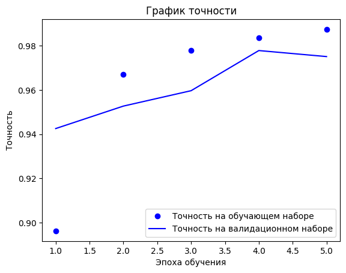
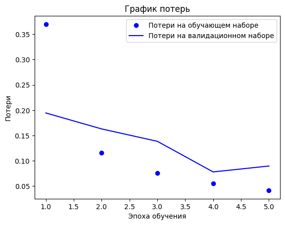
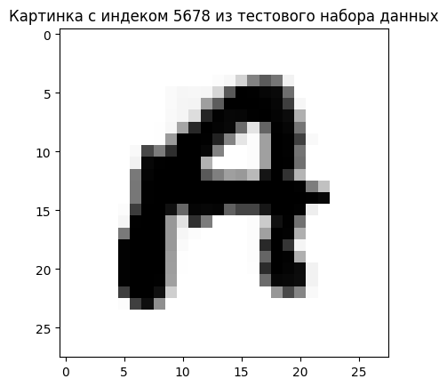

# Handwritten-letter-recognition

**Проект по классификации изображений рукописных букв с использованием полносвязных нейронных сетей.**

---

## Описание проекта

Проект посвящён созданию модели для распознавания рукописных букв английского алфавита (A-Z) на основе датасета [A_Z Handwritten Data](https://www.kaggle.com/sachinpatel21/az-handwritten-alphabets-in-csv-format). Модель обучается на наборе изображений размером 28×28 пикселей и способна классифицировать буквы с высокой точностью.

---

## Структура проекта

- **Данные**: Датасет содержит 201,095 изображений рукописных букв (после удаления дубликатов).
- **Предобработка**: Нормализация, балансировка классов с помощью SMOTE, разделение на обучающую, валидационную и тестовую выборки.
- **Модель**: Полносвязная нейронная сеть с архитектурой:
  - Входной слой: 784 нейрона (28×28 пикселей).
  - Скрытые слои: 512 и 256 нейронов с активацией ReLU.
  - Выходной слой: 26 нейронов с активацией Softmax.
- **Обучение**: Оптимизатор RMSprop, функция потерь — категориальная кросс-энтропия.
- **Результаты**: Точность на тестовом наборе — **97.6%**.

---

## Основные этапы

1. **Загрузка и предобработка данных**:
   - Удаление дубликатов.
   - Нормализация значений пикселей в диапазон [0, 1].
   - Балансировка классов с помощью SMOTE.

2. **Построение модели**:
   - Использование Keras для создания полносвязной нейронной сети.
   - Компиляция модели с оптимизатором RMSprop.

3. **Обучение и оценка**:
   - Обучение на 5 эпохах с batch_size=254.
   - Оценка точности и потерь на тестовом наборе.

4. **Визуализация**:
   - Графики точности и потерь на обучающем и валидационном наборах.
   - Пример распознавания буквы из тестового набора.

---

## Результаты
   Метрика                     | Значение  |
 |-----------------------------|-----------|
 | Точность на тестовом наборе | 97.6%     |
 | Потери на тестовом наборе   | 0.094     |

### Графики обучения

- **Точность**:

  

- **Потери**:

  

---

## Пример работы

### Распознавание буквы из тестового набора

- **Распознана буква**: A
- **Правильная буква**: A
